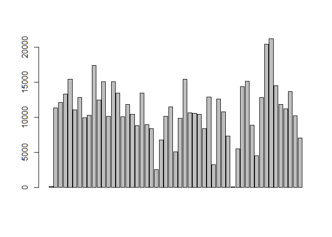
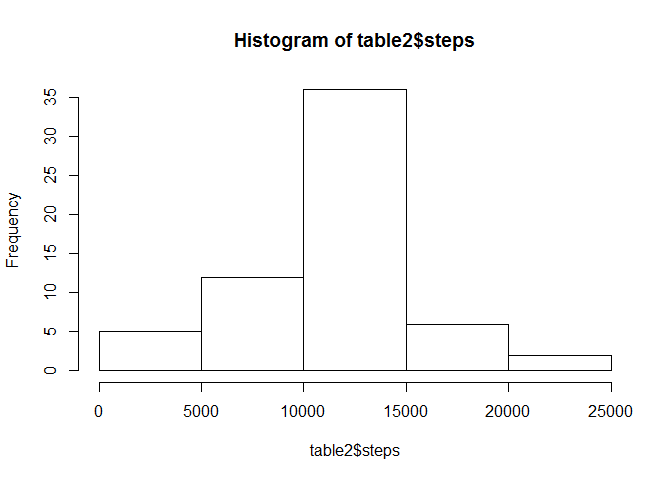
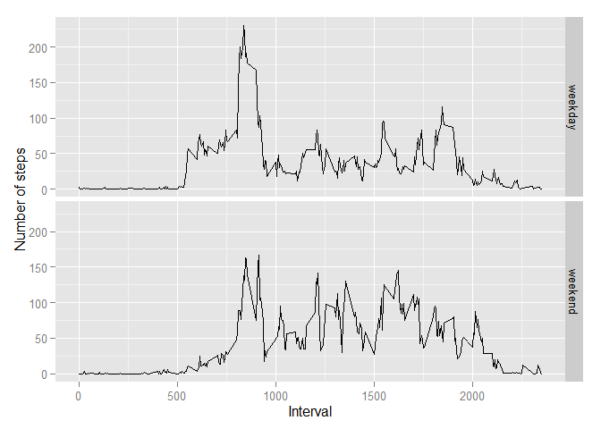

# PA1_template.Rmd
Christian Llano  
Friday, June 12, 2015  


##Loading and preprocessing the data

I read data using Rstudio option, import data sets.

```r
activity <- read.csv("activity.csv")
#changing to date type
activity$date<-as.Date(activity$date,"%Y-%m-%d")
head(activity)
```

```
##   steps       date interval
## 1    NA 2012-10-01        0
## 2    NA 2012-10-01        5
## 3    NA 2012-10-01       10
## 4    NA 2012-10-01       15
## 5    NA 2012-10-01       20
## 6    NA 2012-10-01       25
```

## What is mean total number of steps taken per day?


```r
#1. Calculate the total number of steps taken per day
aggregate(steps~date,data=activity,sum,na.rm=T)->x
head(x)
```

```
##         date steps
## 1 2012-10-02   126
## 2 2012-10-03 11352
## 3 2012-10-04 12116
## 4 2012-10-05 13294
## 5 2012-10-06 15420
## 6 2012-10-07 11015
```

```r
#2 Here a boxplot of x 
barplot(x[,2])
```

 

```r
#3 Finding mean total number of steps.

mean(activity$steps,na.rm=TRUE)
```

```
## [1] 37.3826
```

```r
#3 Calculating mean and median of the total number of steps taken per day
aggregate(steps~date,data=activity,function(x) c(Mean=mean(x,na.rm=T),Median=median(x,na.rm=T)))
```

```
##          date steps.Mean steps.Median
## 1  2012-10-02  0.4375000    0.0000000
## 2  2012-10-03 39.4166667    0.0000000
## 3  2012-10-04 42.0694444    0.0000000
## 4  2012-10-05 46.1597222    0.0000000
## 5  2012-10-06 53.5416667    0.0000000
## 6  2012-10-07 38.2465278    0.0000000
## 7  2012-10-09 44.4826389    0.0000000
## 8  2012-10-10 34.3750000    0.0000000
## 9  2012-10-11 35.7777778    0.0000000
## 10 2012-10-12 60.3541667    0.0000000
## 11 2012-10-13 43.1458333    0.0000000
## 12 2012-10-14 52.4236111    0.0000000
## 13 2012-10-15 35.2048611    0.0000000
## 14 2012-10-16 52.3750000    0.0000000
## 15 2012-10-17 46.7083333    0.0000000
## 16 2012-10-18 34.9166667    0.0000000
## 17 2012-10-19 41.0729167    0.0000000
## 18 2012-10-20 36.0937500    0.0000000
## 19 2012-10-21 30.6284722    0.0000000
## 20 2012-10-22 46.7361111    0.0000000
## 21 2012-10-23 30.9652778    0.0000000
## 22 2012-10-24 29.0104167    0.0000000
## 23 2012-10-25  8.6527778    0.0000000
## 24 2012-10-26 23.5347222    0.0000000
## 25 2012-10-27 35.1354167    0.0000000
## 26 2012-10-28 39.7847222    0.0000000
## 27 2012-10-29 17.4236111    0.0000000
## 28 2012-10-30 34.0937500    0.0000000
## 29 2012-10-31 53.5208333    0.0000000
## 30 2012-11-02 36.8055556    0.0000000
## 31 2012-11-03 36.7048611    0.0000000
## 32 2012-11-05 36.2465278    0.0000000
## 33 2012-11-06 28.9375000    0.0000000
## 34 2012-11-07 44.7326389    0.0000000
## 35 2012-11-08 11.1770833    0.0000000
## 36 2012-11-11 43.7777778    0.0000000
## 37 2012-11-12 37.3784722    0.0000000
## 38 2012-11-13 25.4722222    0.0000000
## 39 2012-11-15  0.1423611    0.0000000
## 40 2012-11-16 18.8923611    0.0000000
## 41 2012-11-17 49.7881944    0.0000000
## 42 2012-11-18 52.4652778    0.0000000
## 43 2012-11-19 30.6979167    0.0000000
## 44 2012-11-20 15.5277778    0.0000000
## 45 2012-11-21 44.3993056    0.0000000
## 46 2012-11-22 70.9270833    0.0000000
## 47 2012-11-23 73.5902778    0.0000000
## 48 2012-11-24 50.2708333    0.0000000
## 49 2012-11-25 41.0902778    0.0000000
## 50 2012-11-26 38.7569444    0.0000000
## 51 2012-11-27 47.3819444    0.0000000
## 52 2012-11-28 35.3576389    0.0000000
## 53 2012-11-29 24.4687500    0.0000000
```

```r
#4 Mean of steps by interval
as.data.frame(aggregate(steps~interval,data=activity,mean,na.rm=TRUE))->x1

#5 Next we obtain the maximum of mean steps by interval
x1[which.max(x1$steps),]
```

```
##     interval    steps
## 104      835 206.1698
```

We seee that median is 0 in all cases, this happens because most of the steps during intervals resulting to be 0

## What is the average daily activity pattern?

Using the x1 created before, where we summarize mean of steps by intervals


```r
plot(x1,type="l")
```

 


## Imputing missing values


```r
#How many NA values are by column on activity
apply(activity,2,function(x)sum(is.na(x)))
```

```
##    steps     date interval 
##     2304        0        0
```

```r
#Looking for mean according to date
x2<-aggregate(steps~date,data=activity,mean,na.rm=TRUE)

#Looking for mean according to intervals
x3<-aggregate(steps~interval,data=activity,mean,na.rm=TRUE)
```

I decided to replace NA values by the mean of its interval as showing next:


```r
#merging activity and x3 by the column interval.
merge(activity,x3,by = "interval")->data1
head(data1)
```

```
##   interval steps.x       date  steps.y
## 1        0      NA 2012-10-01 1.716981
## 2        0       0 2012-11-23 1.716981
## 3        0       0 2012-10-28 1.716981
## 4        0       0 2012-11-06 1.716981
## 5        0       0 2012-11-24 1.716981
## 6        0       0 2012-11-15 1.716981
```

```r
#copying values of means by interval to its corresponding NA values
data1$steps.x[is.na(data1$steps.x)]<-data1$steps.y[is.na(data1$steps.x)]

#ordering and looking to first cases
data1<-data1[order(data1$date,data1$interval),]
data1$steps.y<-NULL
names(data1)[2]<-"steps"
head(data1)
```

```
##     interval     steps       date
## 1          0 1.7169811 2012-10-01
## 63         5 0.3396226 2012-10-01
## 128       10 0.1320755 2012-10-01
## 205       15 0.1509434 2012-10-01
## 264       20 0.0754717 2012-10-01
## 327       25 2.0943396 2012-10-01
```

```r
#total steps, mean and median by day on data1

table2<-aggregate(steps~date,data=data1,sum)
barplot(table2[,2])
```

 

```r
hist(table2$steps)
```

 

```r
table3<-aggregate(steps~date,data=data1,function(x) c(Sum= sum(x),Mean=mean(x),Median=median(x)))
head(table3)
```

```
##         date   steps.Sum  steps.Mean steps.Median
## 1 2012-10-01 10766.18868    37.38260     34.11321
## 2 2012-10-02   126.00000     0.43750      0.00000
## 3 2012-10-03 11352.00000    39.41667      0.00000
## 4 2012-10-04 12116.00000    42.06944      0.00000
## 5 2012-10-05 13294.00000    46.15972      0.00000
## 6 2012-10-06 15420.00000    53.54167      0.00000
```


## Are there differences in activity patterns between weekdays and weekends?

```r
#Creating week according to weekday o weekend on date
data1$week<-ifelse(weekdays(data1$date)%in%c("sábado","domingo"),"weekend","weekday")
head(data1)
```

```
##     interval     steps       date    week
## 1          0 1.7169811 2012-10-01 weekday
## 63         5 0.3396226 2012-10-01 weekday
## 128       10 0.1320755 2012-10-01 weekday
## 205       15 0.1509434 2012-10-01 weekday
## 264       20 0.0754717 2012-10-01 weekday
## 327       25 2.0943396 2012-10-01 weekday
```

```r
table4<-aggregate(steps~interval+week,data=data1,mean)
head(table4)
```

```
##   interval    week      steps
## 1        0 weekday 2.25115304
## 2        5 weekday 0.44528302
## 3       10 weekday 0.17316562
## 4       15 weekday 0.19790356
## 5       20 weekday 0.09895178
## 6       25 weekday 1.59035639
```

```r
levels(as.factor(as.character(data1$interval2)))->xlab
```

Now I plot using ggplot2

```r
### Graphics

library(ggplot2)

ggplot(table4,aes(interval,steps))->qpl1

summary(qpl1)
```

```
## data: interval, week, steps [576x3]
## mapping:  x = interval, y = steps
## faceting: facet_null()
```

```r
qpl1+
    geom_line()+
    facet_grid(week~.)+
    xlab("Interval")+
    ylab("Number of steps")
```

 

We can note there is a remarkable difference onpatterns of steps, in intervals between 10:00 to 20:00 

